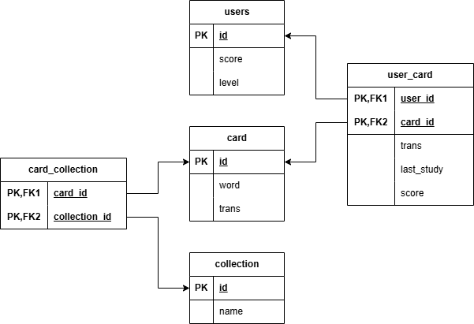

# Курсовая работа «Телеграм-бот English Cards»

[Требования к работе](https://github.com/netology-code/sqlpy-diplom/blob/main/README.md)

- [Структура данных](#db)
- [Структура проекта](#files)
- [Особенности реализации работы с БД](#orm)
- [Функциональность Телеграм-бота](#bot)

Данный проект представляет собой простой Телеграм-бот,
который позволяет пользователю создавать пары слов на 
английском и русском языках и затем тренировать их, 
выбирая правильный перевод.

## Структура данных

Схема базы данных проекта представлена на рисунке:

Данные хранятся в следующих таблицах:

- `users` &mdash; данные о пользователях.
  - `id` &mdash; уникальный ID пользователя в Телеграме.
  - `score` &mdash; количество баллов, набранных
    пользователем.
  - `level` &mdash; текущий уровень пользователя.
- `card` &mdash; словарь «общих» карточек («карточка» 
  &mdash; это пара: английское слово и его перевод).
  - `id` &mdash; ID карточки.
  - `word` &mdash; английское слово.
  - `trans` &mdash; его перевод.
- `collection` &mdash; коллекции, которым могут 
  принадлежать карточки. Коллекции (так же, как и 
  карточки) создаются автоматически в начале работы бота.
  Они позволяют пользователям не добавлять слова в личные
  словари по одному, а загружать сразу целый набор слов,
  объединённых общей тематикой. 
  - `id` &mdash; ID коллекции.
  - `name` &mdash; название коллекции.
- `user_card` &mdash; личный словарь пользователя.
  - `user_id` &mdash; ID пользователя.
  - `card_id` &mdash; ID карточки.
  - `trans` &mdash; перевод английского слова из 
  карточки (может отличаться от перевода из общей
  карточки)
  - `last_study` &mdash; метка времени, когда
  пользователь в последний раз изучал это слово.
  - `score` &mdash; количество баллов, набранных
  пользователем по данной карточке. Каждый правильный
  ответ увеличивает это количество на 1, каждый
  неправильный &mdash; уменьшает на 1 (но не меньше 0).
- `card_collection` &mdash; отношение принадлежности 
карточки к коллекции.
  - `card_id` &mdash; ID карточки.
  - `collection_id` &mdash; ID коллекции.

## Структура проекта

Проект содержит следующие модули (в порядке от более 
«низкоуровневых» к менее):

- `schema.py` &mdash; функции для создания и удаления
таблиц (об особенностях реализации работы с БД см. 
[ниже](#orm)).
- `db.py` &mdash; маленький скрипт для подключения к БД.
- `model.py` &mdash; описания модельных классов данных.
- `study_manager.py` &mdash; специальный класс, 
предоставляющий методы для управления данными: 
пользователями, карточками, коллекциями. По сути, это API
для организации процесса обучения. Теоретически, 
клиенты этого API могут быть какие угодно, но в нашем 
случае клиент только один &mdash; Телеграм-бот.
- `study_manager_test.py` &mdash; тесты (не очень
тщательные 🙄) для класса StudyManager.
- `cards_bot.py` &mdash; класс, реализующий логику 
Телеграм-бота. Данный класс предоставляет метод 
`launch()` для подготовки (создание таблиц, заполнение их
начальными данными) и запуска бота, а также обработчики
сообщений и запросов чата. Описание возможностей 
Телеграм-бота смотри [ниже](#bot).
- `main.py` &mdash; маленький скрипт, который лишь 
читает переменные среды и запускает Телеграм-бот.

Помимо этого, папка `assets` содержит дополнительные 
ресурсы проекта, в частности:

- `cards` &mdash; несколько JSON-файлов, описывающих
коллекции карточек, которые создаются при запуске бота.
- `bot_strings.json` &mdash; JSON-файл, содержащий все
строки (названия, надписи, сообщения), используемые 
Телеграм-ботом.

### Переменные окружения

При запуске Телеграм-бота из файла `main.py` переменные
среды загружаются из файла `.env`, который отсутствует
в git. Структуру этого файла можно увидеть в файле
`.env.example`.

При запуске тестов из файла `study_manager_test.py` 
переменные среды загружаются из файла `.env.test`,
который также отсутствует в git. Он имеет точно такую же
структуру, за исключением параметра `TG_TOKEN`, который
для тестов не нужен.

## Особенности реализации работы с БД

Автор не очень любит полноценные тяжеловесные ORM, 
поэтому для реализации данного проекта был выбран
легковесный недо-ORM 
[pydapper](https://pydapper.readthedocs.io/en/latest/),
который позволяет писать любые SQL-запросы вручную, но
при этом десериализация объектов в выборке 
осуществляется автоматически на основании описания 
моделей данных (из файла `model.py`).

## Функциональность Телеграм-бота

Телеграм-бот реализует следующие команды:

- `/start` подготавливает всё для дальнейшей работы (в
частности, создаёт в БД запись о пользователе, если её
ещё нет) и выводит приветственное сообщение.
- `/manage` выводит сообщение о количестве карточек в
словаре пользователя, а также встраиваемые кнопки для
управления личным словарём:
  - «Добавить слово» &mdash; позволяет добавить слово
  и его перевод в личный словарь. Если слово уже есть в
  общих карточках, то предлагает либо использовать
  имеющийся перевод, либо ввести свой. Если слово уже
  есть в личном словаре пользователя, то выводится 
  ошибка и предлагается ввести новое слово.
  - «Удалить слово» &mdash; позволяет удалить одно 
  слово из личного словаря пользователя. Если введённого
  слова нет в личном словаре, то выводится ошибка и
  предлагается ввести новое слово.
  - «Загрузить коллекцию» &mdash; позволяет добавить в
  личный словарь сразу несколько слов из выбранной 
  коллекции. Коллекции выводятся в виде встраиваемых
  кнопок.
  - «Посмотреть слова» &mdash; выводит список всех
  карточек (слово &mdash; перевод) из личного словаря
  пользователя.
- `/study` позволяет начать тренировку. Если в личном
словаре пользователя недостаточно карточек (должно быть
не меньше 5), то выводит ошибку и встраиваемые кнопки
для добавления слова и загрузки коллекции. Иначе выводит
слово и четыре варианта перевода в виде кнопок быстрого
ответа. При этом карточки для тренировки отбираются 
случайным образом, но с учётом их веса (чем меньше 
баллов у карточки и чем больше прошло времени с момента 
её последней тренировки, тем больше вес). Кроме того, 
случайным образом определяется направление перевода: с
русского на английский или с английского на русский. 
При правильном ответе баллы карточки и пользователя
увеличиваются на 1, при неправильном &mdash; уменьшаются
на 1 (но никогда не становятся меньше 0). Если в 
результате правильного ответа уровень пользователя, 
который зависит от количества набранных баллов, 
увеличивается, то выводится поздравление. В любом случае
выводится уведомление о том, правильный ли бы ответ (при
неправильном &mdash; выводится верный перевод), а также
встраиваемая кнопка для продолжения тренировки.
- `/stats` выводит статистику пользователя: его счёт (то
есть количество набранных баллов за правильные ответы) и
уровень.

Бонусная возможность: если написать боту любое слово (на
русском или английском), то он вернёт его перевод (если,
конечно, это слово есть в общем словаре).